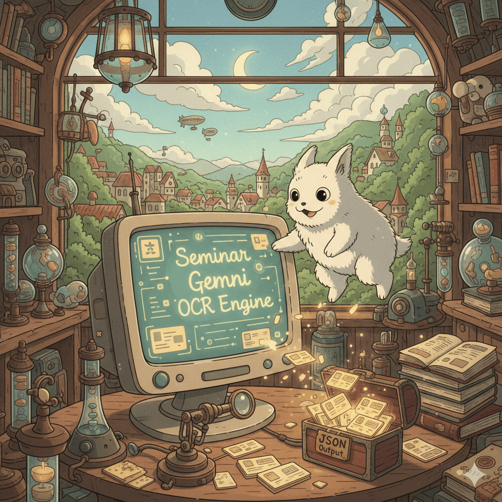

# Seminar Gemini OCR Engine

This project is an intelligent OCR engine designed to extract structured information from business cards. It combines
traditional computer vision techniques (OpenCV) for image preprocessing with the power of Google's Gemini Generative AI
for accurate text extraction and structuring.



## Features

- **Smart Image Preprocessing**: Automatically detects business card boundaries, crops the image, and applies
  perspective correction using OpenCV.
- **AI-Powered Extraction**: Supports multiple engines for extraction:
    - **Google Gemini**: High-performance extraction using models like `gemini-2.0-flash`.
    - **Local LLMs (via Ollama)**: Run OCR locally for privacy and cost-efficiency. Tested with `gemma:4b`, `gemma:12b`, and `minicpm-v`.
- **Parallel Processing**: Efficiently processes multiple images concurrently using `ThreadPoolExecutor`.
- **Resilient Workflow**: Includes retry mechanisms—if extraction fails on the processed image, it automatically retries
  with the original image.
- **JSON Output**: Delivers clean, structured JSON data ready for integration.

## Prerequisites

- Python 3.8 or higher
- **Engine Options**:
    - **Google Gemini**: A Google Gemini API Key.
    - **Local (Ollama)**: [Ollama](https://ollama.com/) installed and running locally with vision-capable models.

## Installation

1. **Clone the repository**
   ```bash
   git clone https://github.com/tranthethang/seminar-gemini-ocr-engine.git
   cd seminar-gemini-ocr-engine
   ```

2. **Set up a virtual environment**
   ```bash
   python3 -m venv .venv
   source .venv/bin/activate  # On Windows: .venv\Scripts\activate
   ```

3. **Install dependencies**
   ```bash
   pip install -r requirements.txt
   ```

## Configuration

1. **Environment Variables**
   Copy the example environment file:
   ```bash
   cp .env.example .env
   ```
   Open `.env` and configure your engine:
   
   **For Google Gemini:**
   ```env
   ENGINE_TYPE=gemini
   GEMINI_API_KEY=your_google_gemini_api_key
   GEMINI_MODEL=gemini-2.0-flash
   ```

   **For Ollama (Local):**
   ```env
   ENGINE_TYPE=ollama
   OLLAMA_BASE_URL=http://localhost:11434
   OLLAMA_MODEL=minicpm-v
   ```

2. **Prompt Customization**
   The extraction logic is defined in `prompt.md`. You can modify this file to change the fields you want to extract or
   the instructions given to the AI.

## Usage

1. **Add Images**
   Place your business card images (JPG, PNG, WEBP) into the `sample_data` directory.

2. **Run the Engine**
   ```bash
   python main.py
   ```

3. **View Results**
    - The script will log progress to the console and `app.log`.
    - Extracted JSON data will be printed to the console.
    - Preprocessed (cropped) images are saved in the `tmp/` directory for inspection.

## Workflow

1. **Load Image**: The system reads images from `sample_data`.
2. **Preprocess**:
    - `app/image_processor.py` detects the card contours.
    - Applies a 4-point perspective transform to "flatten" the card.
3. **Inference**:
    - The processed image is sent to the selected AI engine (Gemini or Ollama) based on `ENGINE_TYPE`.
    - The prompt from `prompt.md` guides the model to return specific JSON fields.
4. **Fallback**: If the model fails to extract a name from the processed image, the system retries with the original raw
   image.
5. **Output**: Final structured data is returned.

## License

This project is licensed under the MIT License. Feel free to use and modify it for your own purposes.
